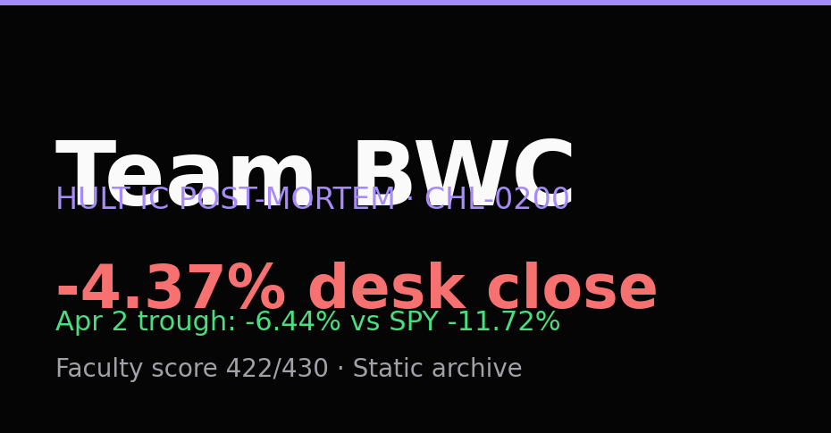

<p align="center">
  <a href="https://kartavya-jharwal.github.io/ganet-project-bwc/">
    
  </a>
</p>

<p align="center">
  <strong>We lost money on the term. We preserved more than SPY at the April trough.</strong><br>
  <sub>Team BWC · Hult CHL-0200 · $1M paper desk · filed close 11 Apr 2026 · static archive</sub>
</p>

<p align="center">
  <a href="https://kartavya.tech/Ganet"></a>
  <a href="https://kartavya-jharwal.github.io/ganet-project-bwc/"></a>
  
  
</p>

<p align="center">
  <a href="https://kartavya.tech">
    
    <strong>Kartavya Jharwal</strong>
  </a>
</p>

<p align="center">
  <a href="https://readme-typing-svg.herokuapp.com?font=Fira+Code&weight=500&size=18&duration=3800&pause=900&color=A78BFA&center=true&vCenter=true&width=680&lines=first-principles+finance+literacy;empirical+trials+under+live+constraints;filed+artifacts+%2B+Python+audit+overlay">
    
  </a>
</p>

<p align="center">
  <a href="https://kartavya-jharwal.github.io/ganet-project-bwc/">
    
  </a>
  <a href="frontend/docs/">
    
  </a>
  <a href="REVIEWERS.md">
    
  </a>
</p>

<p align="center">
  
  
  
  
</p>

---

## What this is

This repository is a **localized deployment** within [**Project Ganet**](https://kartavya.tech/Ganet): an independent initiative mapping systemic financial literacy through an opinionated, first-principles design lens.

Where the upstream project isolates the abstract architecture of fluency, **Adaptive Efficiency** stress-tests theory against execution friction: a ten-week Hult simulation, a $1M mock book run by **Team BWC** (Team 5), **22 filed committee artifacts**, and a reproducible Python overlay (`quant_monitor/`) that audits risk discipline without replacing the graded Excel close.

Engineering sunset completed **2026-05-01** (valuation snapshot **2026-04-10**). **July 2026 polish** targets academics, quants, and recruiters. The live site is the narrative entry point. This repo is the audit trail.

> **Disclaimer:** Independent, unofficial archive. Not affiliated with Hult, the professor, or former teammates. AI-assisted layout and quant documentation. Official grades bind to submitted deliverables only. Faculty sign-off closed (**422 / 430**). If this repo disagrees with the Excel close or filed memo, **the filed artifacts win**.

---

## Three paths

| | Where to go | Best for |
|---|-------------|----------|
| **1** | [**Open the live site →**](https://kartavya-jharwal.github.io/ganet-project-bwc/) | Story, desk results, behavioural audit, faculty evaluation |
| **2** | [**Engineering docs →**](frontend/docs/) | Phases 0–21, architecture, backtest JSON, MkDocs depth |
| **3** | [**Audit the code →**](REVIEWERS.md) | Journal parser, walk-forward HRP, archive seal checklist |

**Grading authority:** [deliverables/](deliverables/README.md) · **Presentation:** [frontend/](frontend/index.html) · **MkDocs source:** [docs/](docs/index.md)

---

## Desk snapshot (graded · Excel close)

| Metric | Value | Notes |
|--------|-------|-------|
| **Total return** | **-4.37%** | $956,280 on $1M start (11 Apr 2026) |
| **SPY (full term)** | **-2.29%** | Desk underperformed by **2.08pp** |
| **Apr 2 trough** | **-6.44%** vs SPY **-11.72%** | **+5.28pp** at the low only |
| **Portfolio beta (close)** | **0.63** | Memo targeted ~1.0 average beta |
| **Win rate** | **28.57%** | Negative expectancy on the term |
| **Faculty score** | **422 / 430** | Sign-off closed |

### Faculty breakdown

| Category | Score |
|----------|-------|
| Architecture & logs | 147 / 150 |
| Strategy & final report | 118 / 120 |
| Client presentation & post-mortem | 118 / 120 |
| Peer evaluation & leadership | 39 / 40 |

Adaptive Efficiency names the framing, not a claim the desk beat the simulation. Trough outperformance does not vindicate full-term Sharpe or expectancy.

---

## What is in the archive

| Layer | Contents |
|-------|----------|
| **Filed deliverables** | 22 artifacts: charter → trading logs → Excel model → post-mortem PDF/PPTX |
| **Public site** | Single-page narrative, Plotly charts, behavioural audit JSON, faculty marks |
| **`quant_monitor/`** | Graphical Lasso topology, HRP sizing, walk-forward backtest, Monte Carlo forward, Brinson attribution |
| **Engineering docs** | Phase timeline, architecture, exported backtest and MC JSON |

**Overlay warning:** `quant_monitor/` answers audit questions on a closed universe. Do not pair overlay returns with desk returns without context. See [full-metrics.json](frontend/data/full-metrics.json) on the live site.

---

## For whom

| Audience | Start here |
|----------|------------|
| **Academics** | [Sources](https://kartavya-jharwal.github.io/ganet-project-bwc/#sources) → [Faculty](https://kartavya-jharwal.github.io/ganet-project-bwc/#evaluation) → [deliverables/](deliverables/README.md) |
| **Quants** | [Desk](https://kartavya-jharwal.github.io/ganet-project-bwc/#evidence) → [Research](https://kartavya-jharwal.github.io/ganet-project-bwc/#research) → [Stack](https://kartavya-jharwal.github.io/ganet-project-bwc/#stack) → [engineering docs](frontend/docs/) |
| **Recruiters** | [Hero + executive summary](https://kartavya-jharwal.github.io/ganet-project-bwc/#executive-summary) → [contact](https://kartavya-jharwal.github.io/ganet-project-bwc/#contact) |

Machine-readable: [llms.txt](frontend/llms.txt) · [site-summary.json](frontend/data/site-summary.json) · [deliverables-manifest.json](frontend/data/deliverables-manifest.json)

---

## Personal brand

<p align="center">
  <a href="https://kartavya.tech/Ganet"><strong>Project Ganet</strong></a>
  &nbsp;·&nbsp;
  <a href="https://kartavya-jharwal.github.io/ganet-project-bwc/"><strong>Adaptive Efficiency</strong></a>
  &nbsp;·&nbsp;
  <a href="https://kartavya.tech">
    
    <strong>Kartavya Jharwal</strong>
  </a>
</p>

<p align="center">
  Three public surfaces, one practice: opinionated finance literacy, empirical archives, and first-principles design under live constraints.
</p>

<p align="center">
  <a href="https://github.com/Kartavya-Jharwal">
    
  </a>
</p>

MIT ([LICENSE](LICENSE)) · forks retain attribution

---

<details>
<summary><strong>Repository map</strong></summary>

| Layer | Path | Role |
|-------|------|------|
| Filed narrative | `deliverables/` | Committee PDF, Excel, charter, journals (**grading authority**) |
| Audit engine | `quant_monitor/` | Walk-forward, stress, behavioural audit |
| Public site | `frontend/` | Single-page archive, charts, JSON hydration |
| Engineering docs | `docs/` → `frontend/docs/` | Ganet technical depth for this freeze |

```
deliverables/       Filed committee packet (22 files)
frontend/           Adaptive Efficiency public site
quant_monitor/      Python audit engine
scripts/            prep_duckdb, build_frontend_assets, sunset_freeze
tests/              Unit tests + journal fixtures
docs/               MkDocs source (do not hand-edit built HTML)
```

**Docs policy:** edit markdown under `docs/` only. Rebuild with `uv run python -m mkdocs build -f docs/mkdocs.yml --strict`.

**Not in git:** `portfolio.duckdb`, `.venv/`, secrets.

</details>

<details>
<summary><strong>Quick start (developers)</strong></summary>

```bash
uv sync --frozen
.\scripts\sunset_freeze.ps1    # Windows — or scripts/sunset_freeze.sh
```

Manual rebuild:

```bash
uv run python scripts/prep_duckdb_and_sync.py
uv run python scripts/clean_duckdb_prices.py
uv run python -m pytest tests/ -m "not integration"
uv run python scripts/build_frontend_assets.py
bun run minify:frontend
uv run python -m mkdocs build -f docs/mkdocs.yml --strict
```

Before publication seal:

```bash
bun run minify:frontend
uv run python scripts/sync_deliverables_manual.py
uv run python scripts/verify_repo_health.py --strict-artifacts
```

| CLI | Notes |
|-----|-------|
| `project doctor` | Environment check |
| `project run-backtest` | Walk-forward test |

Prefer `scripts/` for sunset. Avoid `project sync-data` (may start scheduler).

Agent / fork guide: [AGENTS.md](AGENTS.md) · [CLAUDE.md](CLAUDE.md)

</details>
