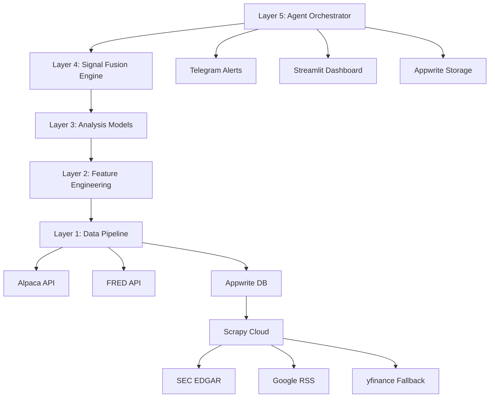

# System Architecture

## 5-Layer Stack

## Infrastructure

| Component | Service | Purpose |
|-----------|---------|---------|
| Compute | Heroku | Worker dyno (signals) + Web dyno (dashboard) |
| Backend | Appwrite Cloud | Database, storage, REST API |
| Scraping | Zyte Scrapy Cloud | SEC EDGAR, Google RSS, price fallback |
| Secrets | Doppler | Environment-aware secret injection |
| CI/CD | GitHub Actions | Lint, test, deploy |
| Docs | GitHub Pages | Post-sunset static archive |

## Data Flow

1. **Scrapy Cloud** spiders run on schedule → push scraped data to **Appwrite DB**
2. **Heroku worker** reads from Appwrite + direct API calls (Alpaca, FRED)
3. Worker computes features → runs 4 models → fuses signals
4. Results written to **Appwrite DB**
5. **Streamlit dashboard** reads from Appwrite API
6. **Telegram alerts** fire on threshold crossings

## Collections (Appwrite)

| Collection | Purpose |
|---|---|
| `portfolio_snapshots` | Periodic portfolio state |
| `position_snapshots` | Per-ticker state at each snapshot |
| `signals` | Model outputs per ticker |
| `alerts` | Alert history |
| `regime_history` | Macro regime transitions |
| `scraped_data` | Raw data from Scrapy Cloud |
