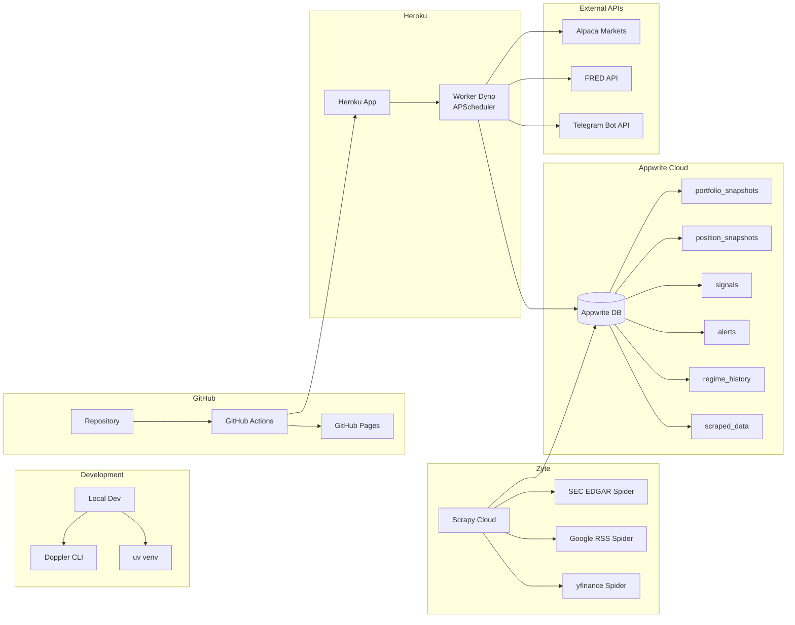

# System Architecture

This document describes the complete architecture of the Ganet - Project BWC system.

---

## Overview

The system follows a 6-layer architecture where data flows upward through processing layers, signals trigger actions, and a final tier computes rigorous post-hoc analytics and predictive forecasting.

```
┌─────────────────────────────────────────────────────────────────────┐
│  LAYER 6: POST-HOC ANALYTICS & FORECASTING (Phase 22+)              │
│  ┌────────────────────┬──────────────────┬───────────────────────┐  │
│  │ Factor Regressions │ Brinson-Fachler  │ Monte Carlo Simulator │  │
│  │ (Fama-French, etc) │ (Attribution)    │ (10,000 paths)        │  │
│  └────────────────────┴──────────────────┴───────────────────────┘  │
│                               ↑ historical state ↑                  │
├─────────────────────────────────────────────────────────────────────┤
│  LAYER 5: AGENT ORCHESTRATOR                                        │
│  ┌────────────────────┬──────────────────┬───────────────────────┐  │
│  │  Decision Engine   │  Risk Manager    │  Alert Dispatcher     │  │
│  │  (APScheduler)     │  (Charter Rules) │  (Telegram)           │  │
│  └────────────────────┴──────────────────┴───────────────────────┘  │
│                               ↓ signals + actions ↓                 │
├─────────────────────────────────────────────────────────────────────┤
│  LAYER 4: SIGNAL FUSION ENGINE                                      │
│  ┌────────────────────────────────────────────────────────────────┐ │
│  │  Dynamic Regime-Weighted Multi-Model Arbitration               │ │
│  │  confidence = 1 - std(all_scores)                              │ │
│  │  fused = Σ(regime_weight[i] × model_score[i])                  │ │
│  └────────────────────────────────────────────────────────────────┘ │
│                               ↑ model scores ↑                      │
├─────────────────────────────────────────────────────────────────────┤
│  LAYER 3: ANALYSIS MODELS                                           │
│  ┌───────────┬──────────────┬────────────────┬──────────────────┐  │
│  │ Technical │ Fundamental  │ Sentiment      │ Macro            │  │
│  │ MA/RSI/   │ P/E, P/S,    │ FinBERT NLP,   │ VIX, DXY,        │  │
│  │ MACD/BBs  │ EV/EBITDA    │ News Score     │ Yield Curve      │  │
│  └───────────┴──────────────┴────────────────┴──────────────────┘  │
│                               ↑ features ↑                          │
├─────────────────────────────────────────────────────────────────────┤
│  LAYER 2: FEATURE ENGINEERING                                       │
│  ┌─────────────────┬─────────────────────┬───────────────────────┐ │
│  │ MA Matrix       │ Volatility          │ Sentiment Processing  │ │
│  │ EMA,SMA,KAMA,   │ Hurst Exponent,     │ FinBERT Scoring,      │ │
│  │ HMA,VWAP,MVWAP  │ Vol Percentile,     │ Rolling Averages,     │ │
│  │                 │ Regime Classifier   │ Momentum              │ │
│  └─────────────────┴─────────────────────┴───────────────────────┘ │
│                               ↑ raw data ↑                          │
├─────────────────────────────────────────────────────────────────────┤
│  LAYER 1: MULTI-SOURCE DATA PIPELINE                                │
│  ┌──────────────────────────────────────────────────────────────┐   │
│  │  Pull → Cache → Normalize → Timestamp-Align → Cross-Validate │   │
│  └──────────────────────────────────────────────────────────────┘   │
│                               ↑ raw feeds ↑                         │
└─────────────────────────────────────────────────────────────────────┘
         │                      │                      │
  ┌──────┴──────┐       ┌──────┴──────┐       ┌──────┴──────┐
  │ Alpaca API  │       │ FRED API    │       │ Scrapy Cloud│
  │ Prices+News │       │ Macro Data  │       │ SEC+RSS+YF  │
  └─────────────┘       └─────────────┘       └──────┬──────┘
                                                     │
                                              ┌──────┴──────┐
                                              │ Appwrite DB │
                                              └─────────────┘
```

---

## Infrastructure Map



Note: UI monitoring is delivered via a Rich CLI dashboard (`quant-dashboard`) and can be run locally or in remote shell sessions. Optional OpenBB views are non-blocking.

---

## Layer 1: Data Pipeline

### Data Sources

| Source | Data Type | Primary Use | Update Frequency |
|--------|-----------|-------------|------------------|
| Alpaca Markets | OHLCV, quotes, news | Real-time prices | 1 min |
| FRED | VIX, DXY, yields | Macro indicators | Daily |
| SEC EDGAR | 8-K, 10-K, 10-Q | Corporate filings | As filed |
| Google RSS | News headlines | Sentiment input | 15 min |
| yfinance | Prices, fundamentals | Fallback | On-demand |

### Failover Strategy

```
Real-time Prices:   Alpaca API → yfinance spider → cached fallback
Historical Prices:  Alpaca API → Appwrite cache
News:               Alpaca API → Google RSS spider
Fundamentals:       yfinance spider → cached (24hr)
Macro:              FRED API (no fallback needed)
```

### Cache TTL Configuration

| Data Type | TTL | Rationale |
|-----------|-----|-----------|
| Real-time quotes | 60s | Balance freshness vs API limits |
| Historical bars | 15 min | Doesn't change during session |
| News | 30 min | New articles don't need instant refresh |
| Macro indicators | 1 hour | FRED data is daily |
| Fundamentals | 24 hours | Changes quarterly |

---

## Layer 2: Feature Engineering

### Moving Average Matrix

For each ticker, compute 8 moving averages to capture different timeframes and responsiveness:

| MA Type | Description | Periods |
|---------|-------------|---------|
| **EMA** | Exponential MA | 9, 21 |
| **SMA** | Simple MA | 50, 200 |
| **KAMA** | Kaufman Adaptive | 10 |
| **HMA** | Hull MA (low lag) | 9 |
| **VWAP** | Session-anchored | Daily |
| **MVWAP** | Moving VWAP | 20-day |

### Volatility / Regime Classification

The Hurst exponent is the key differentiator. Most quant systems only look at volatility level, ignoring whether the market is trending or mean-reverting.

| Regime | Hurst (H) | Volatility | Interpretation |
|--------|-----------|------------|----------------|
| HIGH_VOL_TREND | H > 0.6 | High | Strong trend, ride it |
| HIGH_VOL_CHOP | H < 0.4 | High | Choppy, reduce exposure |
| LOW_VOL_TREND | H > 0.6 | Low | Quiet trend, lean in |
| LOW_VOL_RANGE | H < 0.4 | Low | Sideways, wait |
| TRANSITION | 0.4 ≤ H ≤ 0.6 | Any | Random walk, neutral |

### Sentiment Processing

```
News Headlines → FinBERT → Score ∈ [-1, 1]
                              ↓
                  Time-Decay Weighting (recent > stale)
                              ↓
                  Rolling Averages (3h, 24h, 72h)
                              ↓
                  Sentiment Momentum = short_ma - long_ma
```

---

## Layer 3: Analysis Models

Each model produces a **signal score ∈ [-1, +1]** for each ticker:

| Model | Inputs | Signal Meaning |
|-------|--------|----------------|
| **Technical** | MA crossovers, RSI, MACD, BBs, volume | +1 = strong buy, -1 = strong sell |
| **Fundamental** | P/E, P/S, EV/EBITDA vs sector median | +1 = undervalued, -1 = overvalued |
| **Sentiment** | FinBERT news scores, momentum | +1 = positive sentiment surge, -1 = negative |
| **Macro** | VIX, DXY, yield curve | +1 = risk-on, -1 = risk-off |

### Technical Model Details

```python
# Pseudo-code for technical scoring
def score_technical(ticker):
    ma_signal = score_ma_crossovers(ticker)  # EMA9/21, SMA50/200
    rsi_signal = score_rsi(ticker)           # Overbought/oversold
    macd_signal = score_macd(ticker)         # Histogram direction
    bb_signal = score_bollinger(ticker)      # Squeeze detection
    
    raw_score = average(ma_signal, rsi_signal, macd_signal, bb_signal)
    volume_factor = volume_confirmation(ticker)  # 0.8 to 1.2
    
    return clip(raw_score * volume_factor, -1, 1)
```

### Macro Model Details

```python
def score_macro():
    vix_signal = -1 if VIX > 25 else (0 if VIX > 18 else 1)
    
    yield_curve = YIELD_10Y - YIELD_2Y
    curve_signal = -1 if yield_curve < 0 else (0 if yield_curve < 0.5 else 1)
    
    dxy_change = weekly_pct_change(DXY)
    dxy_signal = -1 if dxy_change > 1.5% else (0 if dxy_change > 0.5% else 1)
    
    return average(vix_signal, curve_signal, dxy_signal)
```

---

## Layer 4: Signal Fusion Engine

### Dynamic Regime Weights

The key innovation: model weights change based on the current volatility regime.

| Regime | Technical | Fundamental | Sentiment | Macro |
|--------|-----------|-------------|-----------|-------|
| HIGH_VOL_TREND | 45% | 15% | 30% | 10% |
| HIGH_VOL_CHOP | 20% | 20% | 25% | 35% |
| LOW_VOL_TREND | 30% | 40% | 15% | 15% |
| LOW_VOL_RANGE | 25% | 35% | 20% | 20% |
| CRISIS | 10% | 10% | 20% | 60% |

### Fusion Algorithm

```python
def fuse(tech, fund, sent, macro, regime):
    weights = REGIME_WEIGHTS[regime]
    
    # Weighted average of tech, fund, sent (macro treated separately)
    base_score = (
        weights['technical'] * tech +
        weights['fundamental'] * fund +
        weights['sentiment'] * sent
    ) / (weights['technical'] + weights['fundamental'] + weights['sentiment'])
    
    # Macro is an adjustment, not blended in
    macro_adjustment = weights['macro'] * macro * 0.5
    
    fused_score = clip(base_score + macro_adjustment, -1, 1)
    
    # Confidence = agreement among models
    confidence = 1 - std([tech, fund, sent, macro])
    
    return fused_score, confidence
```

### Action Determination

```python
CONFIDENCE_MIN = 0.65
FUSED_SCORE_MIN = 0.35

def determine_action(fused_score, confidence):
    if confidence < CONFIDENCE_MIN:
        return "HOLD"  # Models disagree
    
    if fused_score > FUSED_SCORE_MIN:
        return "BUY" if fused_score > 0.6 else "TRIM_UNDERWEIGHT"
    elif fused_score < -FUSED_SCORE_MIN:
        return "SELL" if fused_score < -0.6 else "TRIM_OVERWEIGHT"
    else:
        return "HOLD"
```

---

## Layer 5: Agent Orchestrator

### APScheduler Loop

```python
# Runs every 15 minutes during market hours
scheduler = BackgroundScheduler()

@scheduler.scheduled_job('interval', minutes=15)
def signal_cycle():
    # 1. Fetch fresh data
    prices = pipeline.fetch_prices(tickers)
    macro = pipeline.fetch_macro()
    news = pipeline.fetch_news(tickers)
    
    # 2. Compute features
    ma_matrix = features.compute_ma_matrix(prices)
    regime = features.classify_regime(prices, macro)
    sentiment_scores = features.score_headlines(news)
    
    # 3. Run models
    tech_signals = technical_model.score_all(tickers, ma_matrix)
    fund_signals = fundamental_model.score_all(tickers)
    sent_signals = sentiment_model.score(sentiment_scores)
    macro_signal = macro_model.score(macro)
    
    # 4. Fuse signals
    fused_signals = fusion.fuse_all(
        tech_signals, fund_signals, sent_signals, macro_signal, regime
    )
    
    # 5. Risk check + optimization
    valid_signals = risk_manager.validate(fused_signals)
    target_weights = optimizer.compute_target(valid_signals, regime)
    trades = optimizer.compute_rebalance_trades(target_weights)
    
    # 6. Store results
    appwrite.write_snapshot(portfolio_state)
    appwrite.write_signals(fused_signals)
    
    # 7. Alert if thresholds crossed
    for ticker, signal in valid_signals.items():
        if signal['action'] != 'HOLD':
            alerts.dispatch(ticker, signal)
```

### Risk Manager Rules

| Rule | Constraint | Action |
|------|------------|--------|
| Max single position | 10% of portfolio | Block allocation |
| Max sector exposure | 25% of portfolio | Block allocation |
| Intraday drawdown | >15% on any position | Immediate alert (kill switch) |
| Target beta | 0.20-0.50 (regime-dependent) | Adjust weights |

### Portfolio Optimization

Uses **Black-Litterman** with **pyportfolioopt**:

1. Start with market-cap weighted equilibrium returns
2. Inject model views with confidence weights
3. Compute posterior expected returns
4. Run mean-variance optimization
5. Apply charter constraints

---

## Layer 6: Post-Hoc Analytics & Forecasting (Phase 22+)

Introduced to ensure Epistemic Honesty, this layer analyzes the exact portfolio state (historical & current checkpoint) and projects statistical probabilities rather than relying on deterministic hopes.

### Brinson-Fachler Attribution (`quant_monitor/backtest/attribution.py`)
Separates daily/monthly P&L returns from the benchmark (S&P 500) into mathematical components to answer exactly *why* the portfolio outperformed/underperformed.
- **Allocation Effect:** P&L due to over/underweighting a sector (e.g., Tech).
- **Selection Effect:** P&L from individual stock picks within the sector.
- **Interaction Effect:** Compound effect of both.

### Factor Regression Defaults (`quant_monitor/models/factor.py`)
Uses OLS (Ordinary Least Squares) models mapping the checkpoint data against Fama-French/Carhart factors (via mapped ETF proxies like 'SPY', 'IWM', 'IWD' etc. for simplicity and cost). Resolves exactly how much of the yield comes from implicit factor tilts (Value/Growth, Size, Momentum).

### Forward Monte Carlo Engine (`quant_monitor/backtest/simulation.py`)
Samples actual 29-day trailing portfolio structure (empiric correlation/cholesky decomposition of 18 current positions + cash buffer) projecting 10,000 independent stochastically generated future pathways. 
- **Output:** PDF/CDF plotting probabilities of surpassing checkpoint yield hurdles.

---

## Infrastructure Details

### Heroku Deployment

```yaml
# Procfile
web: streamlit run quant_monitor/dashboard/app.py --server.port=$PORT
worker: python -m quant_monitor.main
```

- **Web dyno**: Serves Streamlit dashboard
- **Worker dyno**: Runs APScheduler signal loop

### Appwrite Collections Schema

#### portfolio_snapshots
```json
{
  "$id": "unique",
  "timestamp": "2026-02-24T12:00:00Z",
  "total_value": 1000000.00,
  "cash": 50000.00,
  "pnl_day": 1200.00,
  "pnl_total": 15000.00,
  "regime": "LOW_VOL_TREND",
  "beta": 0.33
}
```

#### signals
```json
{
  "$id": "unique",
  "timestamp": "2026-02-24T12:00:00Z",
  "ticker": "TSM",
  "technical_score": 0.42,
  "fundamental_score": 0.15,
  "sentiment_score": 0.68,
  "macro_score": 0.10,
  "fused_score": 0.38,
  "confidence": 0.72,
  "action": "BUY",
  "regime": "LOW_VOL_TREND"
}
```

### GitHub Actions Workflows

#### CI Pipeline (`ci.yml`)
- Triggers: push/PR to main
- Steps: Setup Python → uv sync → ruff check → pytest → mypy

#### Deploy Pipeline (`deploy.yml`)
- Triggers: push to main
- Steps: Generate requirements.txt → Deploy to Heroku → Build MkDocs → Deploy to GitHub Pages
- **Note:** GitHub Pages serves as the permanent interactive case study. As of Phase 22+, rendering scripts pull Appwrite data, calculate attribution/distribution curves, embed the resulting histograms/metrics into MkDocs explicitly during this step, and preserve the final post-sunset state indefinitely.

---

## Design Rationale

For detailed design decisions and trade-offs, see [Design Decisions](design.md).

Key architectural choices:
- **DuckDB over PostgreSQL** — Embedded, no server overhead
- **Doppler over .env** — Centralized, environment-aware secrets
- **Heroku over VM** — Managed platform, simple for 2-month project
- **Appwrite over Firebase** — Open-source, GitHub Education credits
- **Local FinBERT over API** — No per-request cost, offline capable

---

*Last updated: February 24, 2026*
