# Project BWC — Mermaid Diagrams

> For Excalidraw renderer, static architecture/infrastructure documentation.
> Paste any block into [mermaid.live](https://mermaid.live) or Excalidraw's Mermaid import.

---

## 1. Full System Architecture

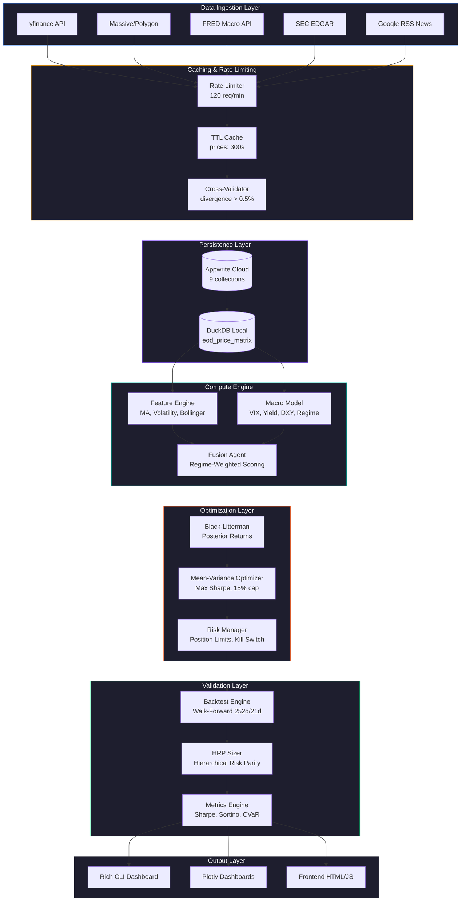

---

## 2. Data Pipeline Sequence Diagram

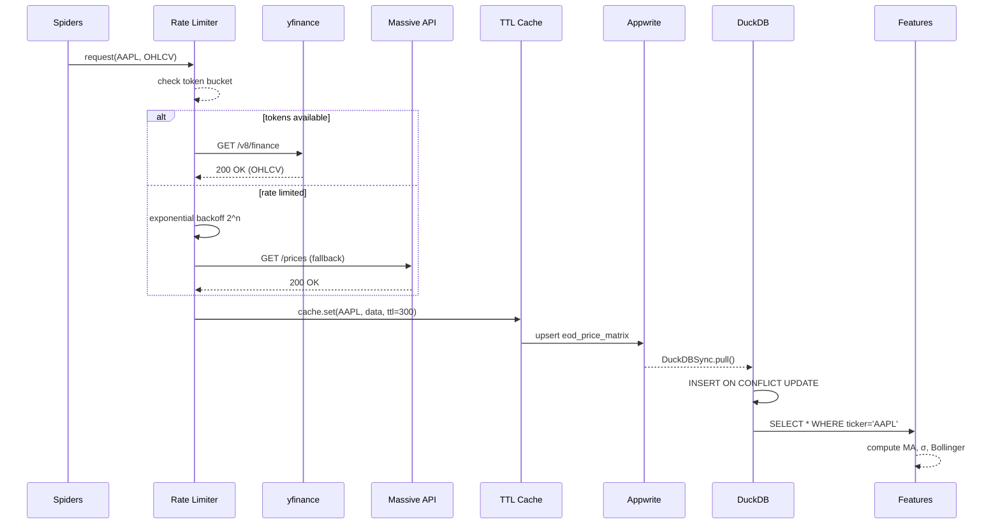

---

## 3. Macro Regime State Machine

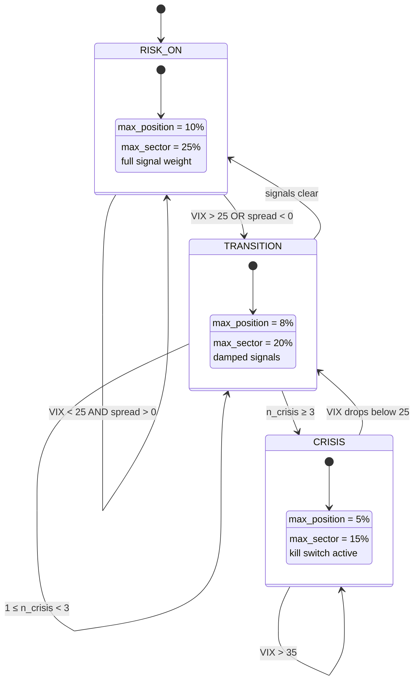

---

## 4. Agent Optimizer Decision Flow

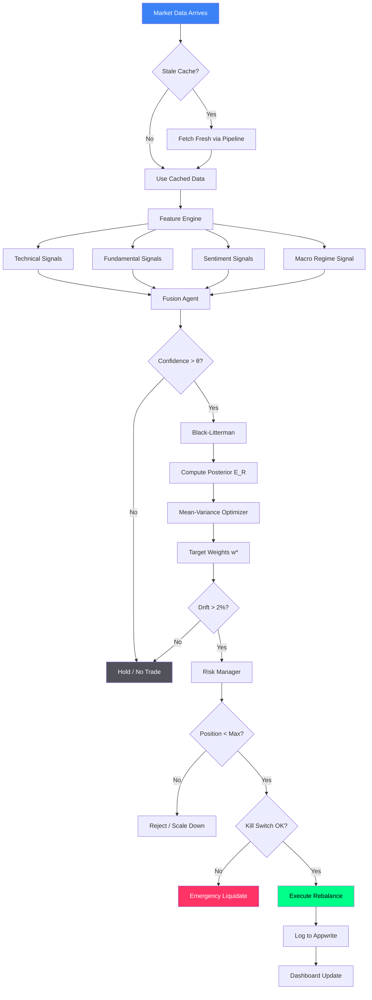

---

## 5. Module Dependency Graph

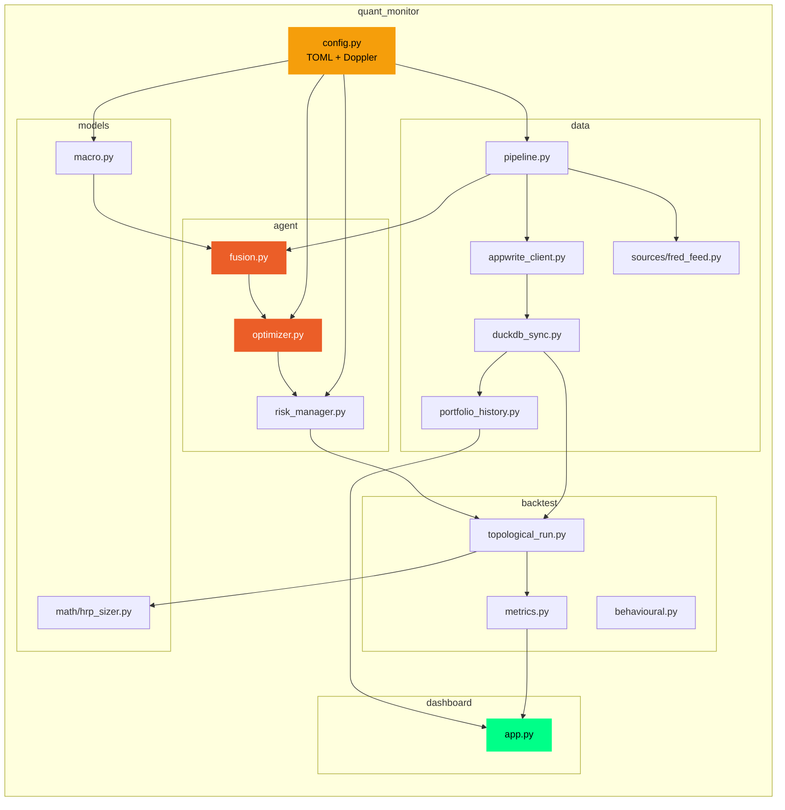

---

## 6. Backtest Walk-Forward Timeline

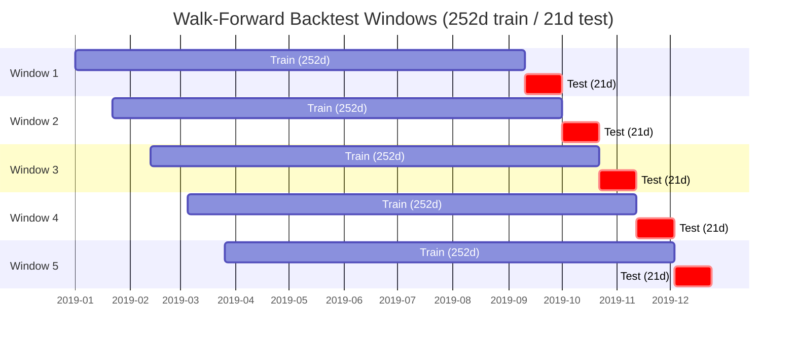

---

## 7. HRP Recursive Bisection Tree

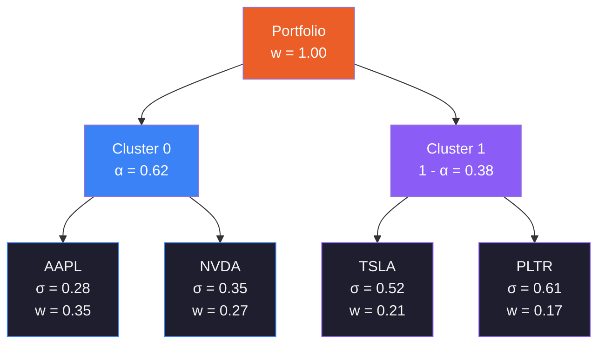

---

## 8. Black-Litterman Pipeline

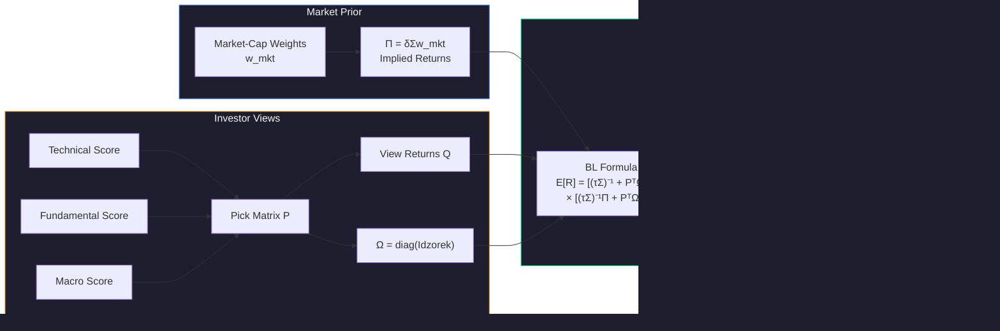

---

## 9. Risk Manager Guard Rails

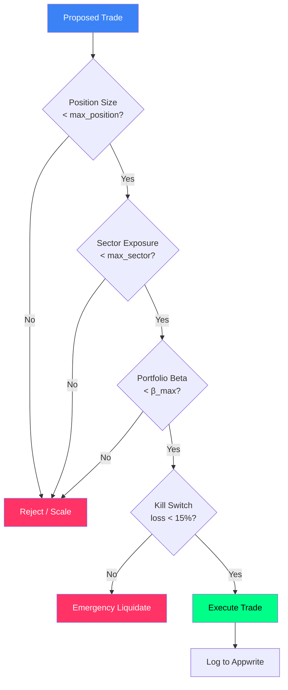

---

## 10. CI/CD Pipeline

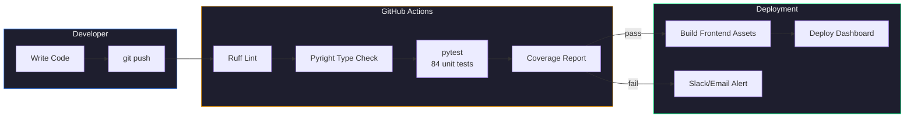

---

## 11. Appwrite Collections Schema

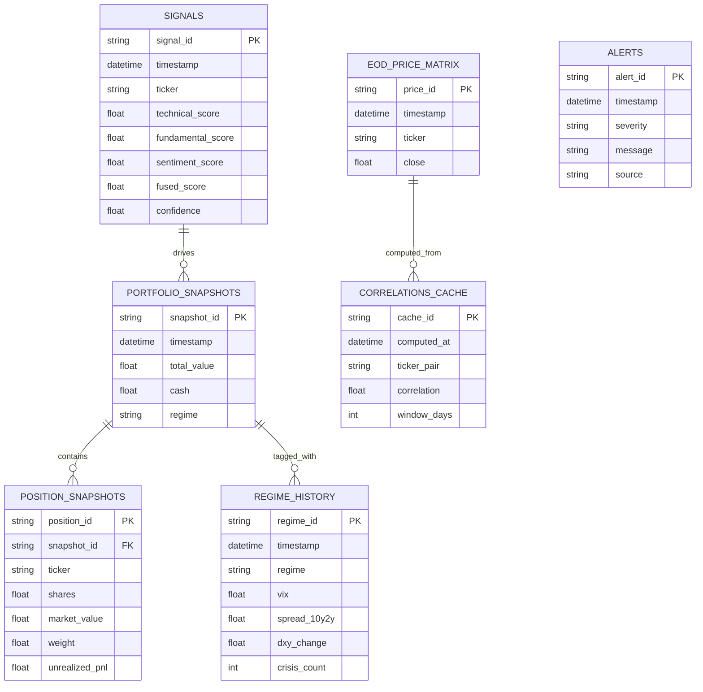

---

## 12. Fama-French Factor Model

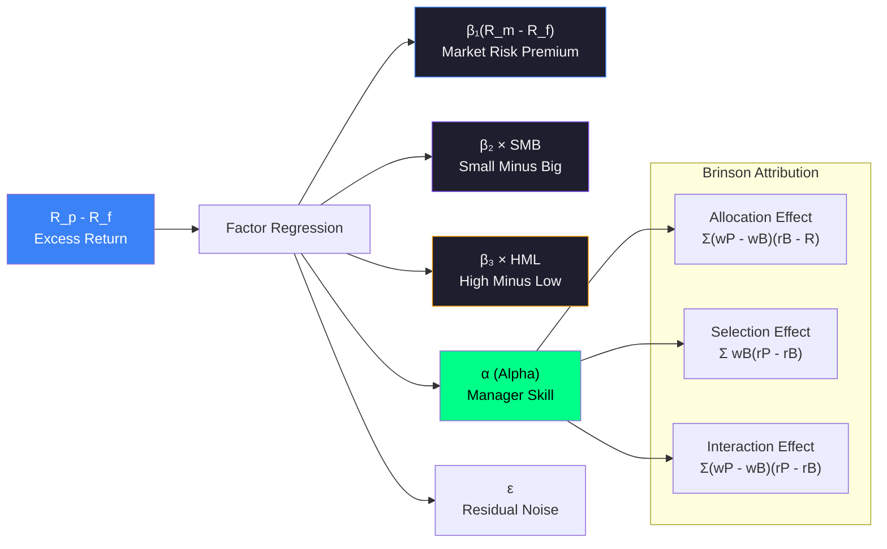

---

## 13. Topological Backtest Flow

```mermaid
flowchart TD
    START[Load DuckDB<br/>eod_price_matrix] --> SPLIT[Walk-Forward Split<br/>252d train / 21d test]
    
    SPLIT --> TRAIN[Training Window]
    TRAIN --> LRET[Log Returns<br/>ln(P_t / P_{t-1})]
    LRET --> GLASSO[Graphical Lasso CV<br/>Sparse Precision Matrix]
    GLASSO --> PCORR["Partial Correlation<br/>ρ_ij = -Θ_ij / √(Θ_ii·Θ_jj)"]
    PCORR --> DIST["Distance Matrix<br/>D_ij = √(½(1-ρ_ij))"]
    DIST --> LINK[Single-Linkage<br/>Clustering]
    LINK --> HRP[HRP Recursive<br/>Bisection Weights]
    
    SPLIT --> TEST[Test Window]
    HRP --> EVAL[Apply Weights<br/>to Test Period]
    TEST --> EVAL
    
    EVAL --> METRICS[Compute Metrics]
    METRICS --> SHARP[Sharpe Ratio<br/>(μ-rf)/σ × √252]
    METRICS --> SORT[Sortino Ratio<br/>Downside Only]
    METRICS --> CALMAR[Calmar Ratio<br/>CAGR / Max DD]
    METRICS --> CVAR["CVaR 5%<br/>Cornish-Fisher"]
    METRICS --> MDD[Max Drawdown]

    style START fill:#8b5cf6,color:#fff
    style GLASSO fill:#eb5e28,color:#fff
    style HRP fill:#00ff88,color:#000
    style METRICS fill:#3b82f6,color:#fff
```

---

## 14. FRED Macro Data Sources

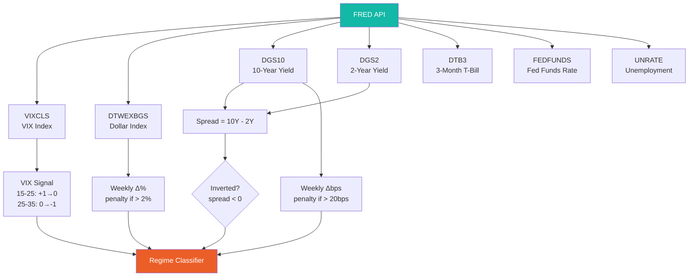

---

## 15. Frontend Architecture

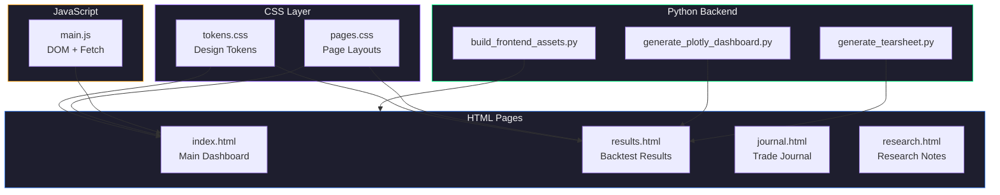

---

## 16. Metrics Computation Reference

| Metric | Formula | Module |
|--------|---------|--------|
| **Sharpe Ratio** | `(μ - r_f) / σ × √252` | `backtest/metrics.py` |
| **Sortino Ratio** | `(μ - r_f) / σ_down × √252` | `backtest/metrics.py` |
| **Calmar Ratio** | `CAGR / \|Max Drawdown\|` | `backtest/metrics.py` |
| **Treynor Ratio** | `(μ - r_f) / β` | `dashboard/app.py` |
| **Jensen's Alpha** | `R_p - [r_f + β(R_m - r_f)]` | `dashboard/app.py` |
| **VaR (Cornish-Fisher)** | `μ + z_CF × σ` | `backtest/metrics.py` |
| **CVaR** | `E[R \| R ≤ VaR]` | `backtest/metrics.py` |
| **Max Drawdown** | `min((NAV - peak) / peak)` | `backtest/metrics.py` |
| **Drawdown Duration** | `max consecutive days below peak` | `backtest/metrics.py` |
| **Tail Ratio** | `\|percentile(95)\| / \|percentile(5)\|` | `backtest/metrics.py` |
| **Portfolio Beta** | `Σ w_i × β_i` | `agent/risk_manager.py` |
| **HRP Distance** | `√(½(1 - ρ_ij))` | `models/math/hrp_sizer.py` |

---

## 17. Configuration Reference

| Section | Key | Default | Purpose |
|---------|-----|---------|---------|
| `[holdings]` | `tickers` | AAPL,NVDA,TSLA... | Universe |
| `[risk]` | `max_position_pct` | 15% | Per-stock cap |
| `[risk]` | `max_sector_pct` | 25% | Sector cap |
| `[risk]` | `kill_switch_loss` | 15% | Emergency exit |
| `[risk]` | `drift_threshold` | 2% | Rebalance trigger |
| `[optimizer]` | `risk_free_rate` | 4% | BL prior |
| `[optimizer]` | `risk_aversion` | 2.5 | MVO λ |
| `[macro]` | `vix_threshold_high` | 35 | Crisis VIX |
| `[macro]` | `spread_inversion` | 0 | Yield curve |
| `[macro]` | `dxy_spike_pct` | 2% | Dollar shock |
| `[cache]` | `prices_ttl` | 300s | Price freshness |
| `[cache]` | `fundamentals_ttl` | 3600s | Fundamental data |

---

## 18. Fusion Agent Scoring

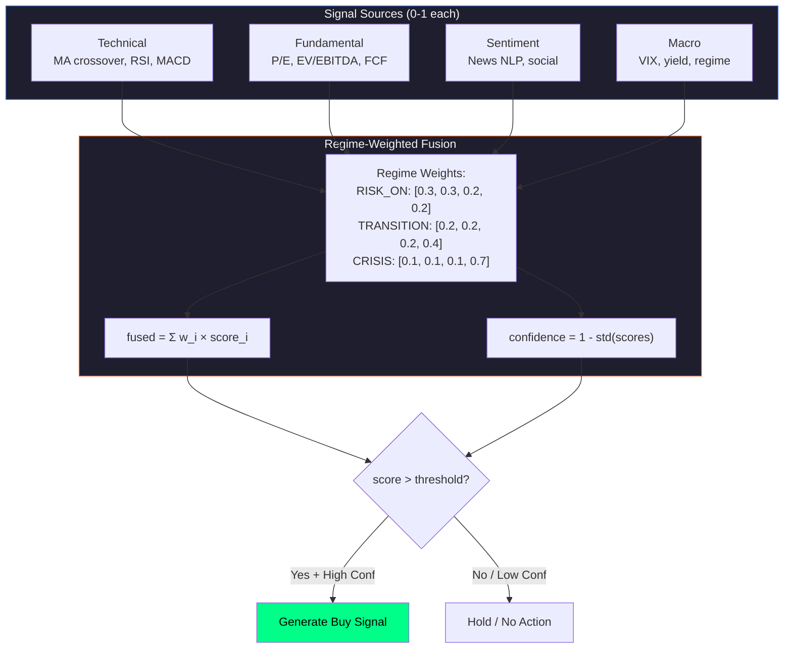

---

## 19. DuckDB Sync Flow

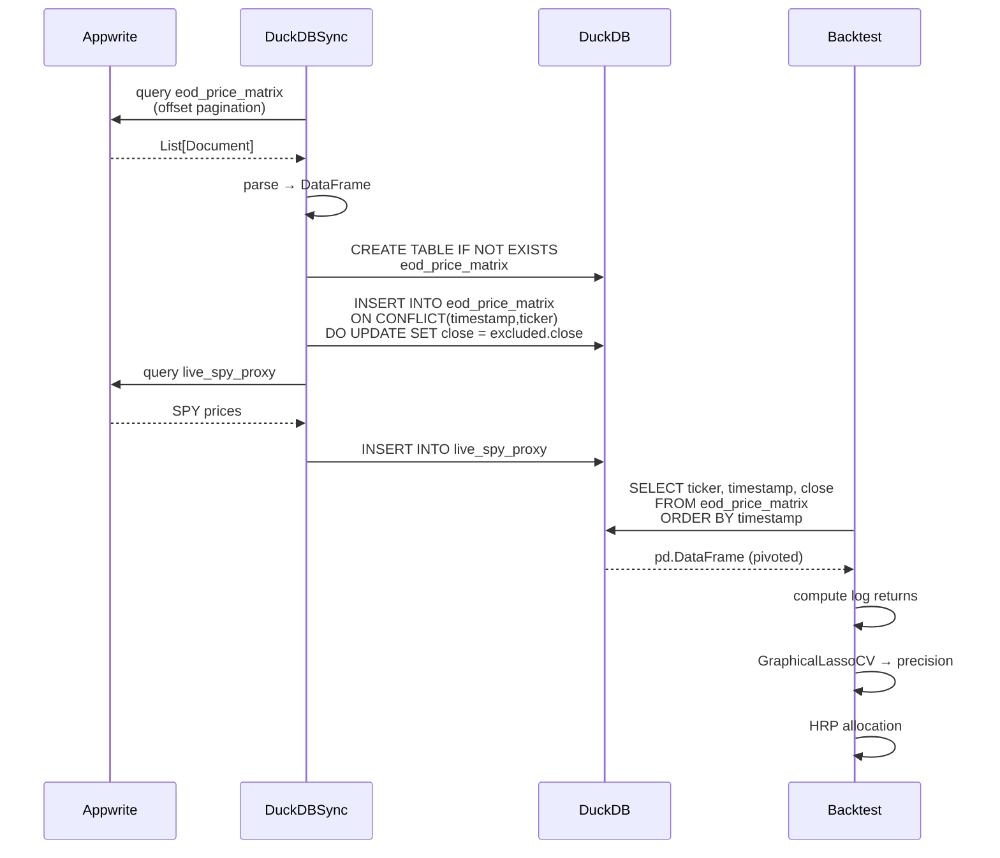

---

## 20. Kill Switch & Emergency Flow

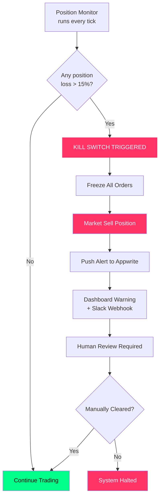
